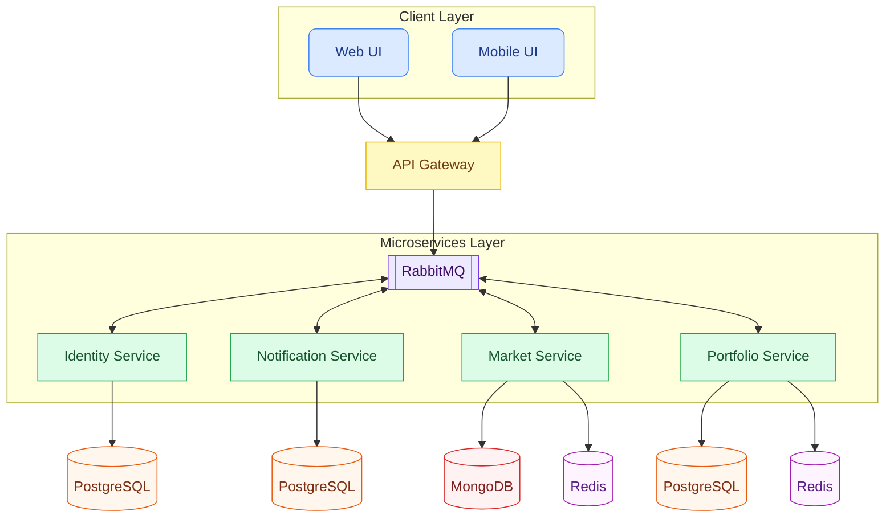

# Crypto Market Microservices

A robust real-time cryptocurrency market application built with a modern microservices architecture, featuring secure authentication, market data management, portfolio tracking, and real-time notifications.

## Architecture Overview

The project is designed using **Microservices Architecture** with a focus on scalability, decoupling, and high availability. It utilizes an **API Gateway** as the single entry point and asynchronous messaging for inter-service communication.



###  Services Breakdown

-   **API Gateway**: Built with **YARP (Yet Another Reverse Proxy)**. It routes incoming requests to the appropriate microservices, providing a unified entry point.
-   **Identity.API**: Handles user authentication, registration, and authorization using **ASP.NET Core Identity** and **PostgreSQL**. It publishes events when new users are created.
-   **Market.API**: Manages cryptocurrency market data (coins, prices). It uses **MongoDB** for high-performance document storage.
-   **Portfolio.API**: Tracks user wallets and asset balances. It consumes events from `Identity.API` to initialize wallets and manages asset transfers via **PostgreSQL**.
-   **Notifications.API**: Processes and sends notifications (e.g., asset transfer confirmations). It consumes events from the message bus.
-   **Shared.Messages**: A common library containing shared event records used for **MassTransit** messaging.

###  Inter-service Communication

Services communicate asynchronously using **MassTransit** over **RabbitMQ**:
-   `UserCreatedEvent`: Published by `Identity.API` when a user registers; consumed by `Portfolio.API` to create an initial wallet.
-   `AssetTransferEvent`: Consumed by `Notifications.API` to trigger user notifications.

##  Technology Stack

-   **Runtime**: .NET 9.0
-   **API Gateway**: YARP
-   **Databases**: 
    -   **PostgreSQL** (Identity, Portfolio)
    -   **MongoDB** (Market)
    -   **Redis** (Distributed Caching)
-   **Messaging**: MassTransit with RabbitMQ
-   **Containerization**: Docker & Docker Compose
-   **CI/CD**: GitHub Actions

##  Getting Started

### Prerequisites

-   [.NET 9.0 SDK](https://dotnet.microsoft.com/download/dotnet/9.0)
-   [Docker Desktop](https://www.docker.com/products/docker-desktop)
-   An IDE (Rider, Visual Studio, or VS Code)

### Installation & Running

1.  **Clone the repository:**
    ```bash
    git clone https://github.com/your-username/Identity.API.git
    cd Identity.API
    ```

2.  **Run with Docker Compose:**
    The easiest way to start the entire infrastructure is using Docker Compose:
    ```bash
    docker-compose up -d
    ```
    This will spin up all microservices along with PostgreSQL, MongoDB, Redis, and RabbitMQ.

3.  **Accessing the services:**
    -   **API Gateway**: `http://localhost:5000`
    -   **RabbitMQ Management**: `http://localhost:15672` (Guest/Guest)
    -   **PostgreSQL**: `localhost:5432`
    -   **MongoDB**: `localhost:27107`

##  API Routes (via Gateway)

| Service | Path Prefix | Description |
| :--- | :--- | :--- |
| **Identity** | `/api/Auth/` | Registration, Login, User Management |
| **Market** | `/api/market/` | Coin listings and market data |
| **Portfolio** | `/api/Wallet/` | User balances and transfers |
| **Notifications** | `/api/notification/` | User notification history |

##  Development

### Running Migrations
For services using PostgreSQL (Identity and Portfolio), ensure migrations are applied:
```bash
dotnet ef database update --project Identity.API
dotnet ef database update --project Portfolio.API
```
