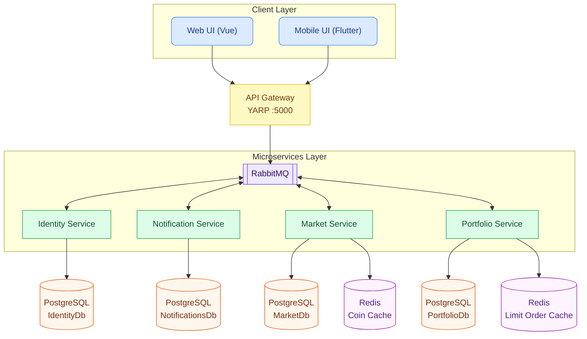
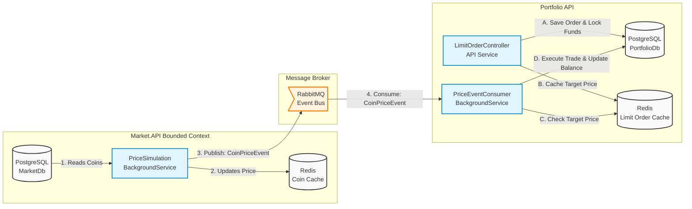

<div align="center">

# Crypto Market Microservices

Real-time cryptocurrency market platform built with .NET 9 microservices — featuring secure JWT authentication, live price streaming, portfolio management with limit orders, price alerts, AI-powered market news, and push notifications via SignalR.

[](https://dotnet.microsoft.com/)
[](https://www.postgresql.org/)
[](https://www.rabbitmq.com/)
[](https://redis.io/)
[](https://www.docker.com/)
[](https://learn.microsoft.com/aspnet/core/signalr/)
[](LICENSE)

</div>

---

## Table of Contents

- [Architecture Overview](#architecture-overview)
- [Services](#services)
- [Technology Stack](#technology-stack)
- [Local Development](#local-development)
- [Docker & Compose Details](#docker--compose-details)
- [Environment Variables](#environment-variables)
- [Ports & Endpoints](#ports--endpoints)
- [API Examples](#api-examples)
- [Messaging & Event Contracts](#messaging--event-contracts)
- [Databases & Migrations](#databases--migrations)
- [Observability](#observability)
- [Health Checks](#health-checks)
- [CI/CD](#cicd)
- [Testing](#testing)
- [Security & Tokens](#security--tokens)
- [Production Notes](#production-notes)
- [Troubleshooting](#troubleshooting)
- [Contributing](#contributing)
- [References](#references)

---

## Architecture Overview

The project follows a **Microservices Architecture** with an **API Gateway** (YARP) as the single entry point. Services communicate asynchronously via **MassTransit** over **RabbitMQ**. Each service owns its own PostgreSQL database. Real-time updates are pushed to clients through **SignalR** hubs.


```mermaid
  graph TB
    subgraph clients["Client Layer"]
        W["Web UI (Vue)"]
        M["Mobile UI (Flutter)"]
    end

    W & M --> GW["API Gateway<br/>YARP :5000"]

    GW --> RMQ

    subgraph backend["Microservices Layer"]
        RMQ[["RabbitMQ"]]

        RMQ <--> ID["Identity Service"]
        RMQ <--> NO["Notification Service"]
        RMQ <--> MK["Market Service"]
        RMQ <--> PF["Portfolio Service"]
    end

    ID  --> PG1[("PostgreSQL<br/>IdentityDb")]
    NO  --> PG2[("PostgreSQL<br/>NotificationsDb")]
    MK  --> PG3[("PostgreSQL<br/>MarketDb")]
    MK  --> RD1[("Redis<br/>Coin Cache")]
    PF  --> PG4[("PostgreSQL<br/>PortfolioDb")]
    PF  --> RD2[("Redis<br/>Limit Order Cache")]

    classDef ui       fill:#dbeafe,stroke:#3b82f6,color:#1e3a8a,rx:8
    classDef gw       fill:#fef9c3,stroke:#eab308,color:#713f12
    classDef bus      fill:#ede9fe,stroke:#7c3aed,color:#3b0764
    classDef svc      fill:#dcfce7,stroke:#16a34a,color:#14532d
    classDef postgres fill:#fff7ed,stroke:#ea580c,color:#7c2d12
    classDef redis    fill:#fdf4ff,stroke:#a21caf,color:#581c87

    class W,M ui
    class GW gw
    class RMQ bus
    class ID,NO,MK,PF svc
    class PG1,PG2,PG3,PG4 postgres
    class RD1,RD2 redis
```

### Real-time Trading Engine & Limit Order Flow

To prevent database bottlenecks during high-frequency price updates, the system utilizes a hybrid approach combining RabbitMQ streams and Redis in-memory caching.


```mermaid
graph LR
    subgraph Market API [Market.API Bounded Context]
        direction TB
        MarketPg[(PostgreSQL<br/>MarketDb)]
        MarketRedis[(Redis<br/>Coin Cache)]
        PriceSim[PriceSimulation<br/>BackgroundService]

        MarketPg -->|1. Reads Coins| PriceSim
        PriceSim -->|2. Updates Price| MarketRedis
    end

    subgraph Message Broker
        RMQ>RabbitMQ<br/>Event Bus]
    end

    PriceSim -->|3. Publish: CoinPriceEvent| RMQ

    subgraph Portfolio API
        direction TB
        PortPgSQL[(PostgreSQL<br/>PortfolioDb)]
        PortRedis[(Redis<br/>Limit Order Cache)]
        OrderSvc[LimitOrderController<br/>API Service]
        Consumer[PriceEventConsumer<br/>BackgroundService]

        OrderSvc -->|A. Save Order & Lock Funds| PortPgSQL
        OrderSvc -->|B. Cache Target Price| PortRedis

        Consumer -->|C. Check Target Price| PortRedis
        Consumer -->|D. Execute Trade & Update Balance| PortPgSQL
    end

    RMQ -->|4. Consume: CoinPriceEvent| Consumer
    
    classDef database fill:#f9f9f9,stroke:#333,stroke-width:2px;
    classDef service fill:#e1f5fe,stroke:#0288d1,stroke-width:2px;
    classDef broker fill:#fff3e0,stroke:#f57c00,stroke-width:2px;
    
    class MarketPg,MarketRedis,PortPgSQL,PortRedis database;
    class PriceSim,OrderSvc,Consumer service;
    class RMQ broker;
```

`Market.API` continuously streams price events via RabbitMQ. `Portfolio.API` consumes these events and evaluates them against active limit orders stored in a local Redis cache, ensuring PostgreSQL is only queried when a trade execution is strictly required.

---

## Services

The solution (`Identity.API.sln`) contains **8 projects**:

| Project | Type | Responsibility | Data Store(s) |
|:--------|:-----|:---------------|:--------------|
| **API.Gateway** | Web API | YARP reverse proxy — single entry point routing requests to downstream services | None |
| **Identity.API** | Web API | User registration, login, JWT token generation using ASP.NET Core Identity | PostgreSQL (`IdentityDb`) |
| **Market.API** | Web API | Coin management, live price simulation, price history, AI-powered market news (Gemini), SignalR market hub | PostgreSQL (`MarketDb`), Redis (coin cache) |
| **Portfolio.API** | Web API | Wallet management, buy/sell assets, asset transfers, limit orders, SignalR portfolio hub | PostgreSQL (`PortfolioDb`), Redis (limit order cache) |
| **Notifications.API** | Web API | Push notifications, price alerts, email notifications (SMTP), SignalR notification hub | PostgreSQL (`NotificationsDb`) |
| **Shared.Messages** | Class Library | Shared MassTransit event contracts consumed by all services | — |
| **Shared.Infrastructure** | Class Library | Cross-cutting concerns: OpenTelemetry tracing, health checks, correlation ID / logging / exception-handling middleware | — |
| **docker-compose** | Docker Compose | Orchestration project for Visual Studio container tooling | — |

---

## Technology Stack

- **Runtime**: .NET 9.0
- **API Gateway**: YARP (Yet Another Reverse Proxy)
- **Databases**: PostgreSQL (Identity, Market, Portfolio, Notifications)
- **Caching**: Redis 6.2 (Market coin prices, Portfolio limit orders)
- **Messaging**: RabbitMQ 3 Management + MassTransit
- **Real-time**: SignalR (Market, Portfolio, Notifications hubs)
- **AI**: Google Gemini (`gemini-2.5-flash`) for market news generation
- **Observability**: OpenTelemetry + Jaeger
- **Email**: SMTP (Gmail)
- **Containerization**: Docker & Docker Compose
- **CI/CD**: GitHub Actions
- **IDE**: Visual Studio 2026

---

## Local Development

### Prerequisites

- [.NET 9.0 SDK](https://dotnet.microsoft.com/download/dotnet/9.0)
- [Docker Desktop](https://www.docker.com/products/docker-desktop)
- [Visual Studio 2026](https://visualstudio.microsoft.com/) (or Rider / VS Code)

### Option 1 — Run Everything with Docker Compose

```bash
# 1. Clone the repository
git clone https://github.com/ibrahimkabadayi/Identity.API.git
cd Identity.API

# 2. Copy and configure environment variables
cp .env.example .env
# Edit .env and fill in secrets (JWT_SECRET_KEY, AI_KEY, EMAIL_PASSWORD)

# 3. Start all services + infrastructure
docker compose up -d --build

# Expected startup time: ~60–90 seconds (RabbitMQ health check gates service startup)
```

All services, PostgreSQL, Redis, RabbitMQ, and Jaeger will start. The API Gateway is available at `http://localhost:5000`.

### Option 2 — Run Individual Services Locally

Start infrastructure first, then run a specific service with `dotnet run`:

```bash
# Start only infrastructure (Postgres, Redis, RabbitMQ, Jaeger)
docker compose up -d postgres.db redis rabbitmq jaeger
```

Then run any service. Each service's `appsettings.Development.json` overrides connection strings to point to `localhost`:

```bash
# Identity.API — http://localhost:5145
dotnet run --project Identity.API/Identity.API.csproj

# Market.API — http://localhost:5226
dotnet run --project Market.API/Market.API.csproj

# Portfolio.API — http://localhost:5252
dotnet run --project Portfolio.API/Portfolio.API.csproj

# Notifications.API — http://localhost:5291
dotnet run --project Notifications.API/Notifications.API.csproj

# API Gateway — http://localhost:5161
dotnet run --project API.Gateway/API.Gateway.csproj
```

> **Note:** When running locally, services use the `Development` environment automatically. Override any setting via environment variables:
> ```bash
> set Jwt__Key=YourKeyHere
> set RabbitMQ__Host=localhost
> dotnet run --project Identity.API/Identity.API.csproj
> ```

### Option 3 — Visual Studio 2026

1. Open `Identity.API.sln` in Visual Studio 2026.
2. **Docker Compose (full stack):** Right-click the `docker-compose` project → **Set as Startup Project** → press **F5**.
3. **Single service:** Right-click any API project (e.g., `Identity.API`) → **Set as Startup Project** → press **F5**. The `http` launch profile starts the service on its configured local port.

### Local Service Ports (dotnet run)

| Service | HTTP | HTTPS |
|:--------|:-----|:------|
| Identity.API | `http://localhost:5145` | `https://localhost:7081` |
| Market.API | `http://localhost:5226` | `https://localhost:7080` |
| Portfolio.API | `http://localhost:5252` | `https://localhost:7110` |
| Notifications.API | `http://localhost:5291` | `https://localhost:7029` |
| API.Gateway | `http://localhost:5161` | `https://localhost:7049` |

---

## Docker & Compose Details

### Port Mappings

All application containers listen internally on port **8080**. The host ports are:

| Service | Host Port | Container Port | URL |
|:--------|:----------|:---------------|:----|
| **API Gateway** | `5000` | `8080` | `http://localhost:5000` |
| **Identity.API** | `8001` | `8080` | `http://localhost:8001` |
| **Market.API** | `8002` | `8080` | `http://localhost:8002` |
| **Notifications.API** | `6000` | `8080` | `http://localhost:6000` |
| **Portfolio.API** | `7000` | `8080` | `http://localhost:7000` |
| **PostgreSQL** | `5432` | `5432` | `localhost:5432` |
| **Redis** | `6379` | `6379` | `localhost:6379` |
| **RabbitMQ (AMQP)** | `5672` | `5672` | `localhost:5672` |
| **RabbitMQ (Management)** | `15672` | `15672` | `http://localhost:15672` |
| **Jaeger (UI)** | `16686` | `16686` | `http://localhost:16686` |
| **Jaeger (OTLP gRPC)** | `4317` | `4317` | `localhost:4317` |

### Dockerfiles

Each service uses a multi-stage Dockerfile based on `mcr.microsoft.com/dotnet/aspnet:9.0` (runtime) and `mcr.microsoft.com/dotnet/sdk:9.0` (build). Build arg: `BUILD_CONFIGURATION=Release`.

| Service | Dockerfile Path |
|:--------|:----------------|
| API.Gateway | `API.Gateway/Dockerfile` |
| Identity.API | `Identity.API/Dockerfile` |
| Market.API | `Market.API/Dockerfile` |
| Notifications.API | `Notifications.API/Dockerfile` |
| Portfolio.API | `Portfolio.API/Dockerfile` |

### Docker Images

Images are named via the `DOCKER_REGISTRY` env var (defaults to empty):

| Service | Image Name |
|:--------|:-----------|
| API Gateway | `${DOCKER_REGISTRY-}apigateway` |
| Identity.API | `${DOCKER_REGISTRY-}identityapi` |
| Market.API | `${DOCKER_REGISTRY-}marketapi` |
| Notifications.API | `${DOCKER_REGISTRY-}notificationsapi` |
| Portfolio.API | `${DOCKER_REGISTRY-}portfolioapi` |

### Volumes

| Volume | Mount Path | Purpose |
|:-------|:-----------|:--------|
| `postgres_data` | `/var/lib/postgresql` | Persistent PostgreSQL data |
| `redis_data` | `/data` | Persistent Redis data |
| `rabbitmq_data` | `/var/lib/rabbitmq` | Persistent RabbitMQ queues and config |

### Service Dependencies

All API services depend on:
- `rabbitmq` — with `condition: service_healthy` (waits for RabbitMQ health check)
- `postgres.db` — with `condition: service_started`

---

## Environment Variables

All variables are read from a `.env` file in the repository root. See [`.env.example`](.env.example) for the full template.

### Variable Reference

| Variable | Used By | Secret? | Description |
|:---------|:--------|:--------|:------------|
| `RABBITMQ_USER` | All API services | No | RabbitMQ username |
| `RABBITMQ_PASS` | All API services | No | RabbitMQ password |
| `JWT_SECRET_KEY` | All API services, Postgres, Redis | **Yes** | Symmetric key for JWT signing (min 32 chars) |
| `AI_KEY` | Market.API | **Yes** | Google Gemini API key (`Gemini__ApiKey`) |
| `EMAIL_PASSWORD` | Notifications.API | **Yes** | SMTP password (`EmailSettings__Password`) |
| `POSTGRES_USERNAME` | postgres.db | No | PostgreSQL superuser |
| `POSTGRES_PASSWORD` | postgres.db | **Yes** | PostgreSQL password |
| `REDIS_USERNAME` | redis | No | Redis ACL username (unused by default) |
| `REDIS_PASSWORD` | redis | No | Redis ACL password (unused by default) |
| `DOCKER_REGISTRY` | docker-compose | No | Docker image name prefix (optional) |

### Connection String Template

Connection strings are set inline in `docker-compose.yml`. The pattern is:

```
ConnectionStrings__DefaultConnection=Host=postgres.db;Port=5432;Database=<DB_NAME>;Username=postgres;Password=Password123*
```

| Service | Database Name |
|:--------|:-------------|
| Identity.API | `IdentityDb` |
| Market.API | `MarketDb` |
| Portfolio.API | `PortfolioDb` |
| Notifications.API | `NotificationsDb` |

### Secret Storage

- **Development:** Use `.env` file (already in `.gitignore`).
- **CI/CD:** Store secrets in GitHub repository secrets (`Settings → Secrets`). Required secrets: `DOCKER_USERNAME`, `DOCKER_PASSWORD`, `JWT_SECRET_KEY`, `AI_KEY`, `EMAIL_PASSWORD`.
- **Production:** Use a dedicated secret store (Azure Key Vault, AWS Secrets Manager, HashiCorp Vault) or Kubernetes secrets.

---

## Ports & Endpoints

### YARP Gateway Routes

All client requests go through the API Gateway at `http://localhost:5000`. The gateway forwards them to internal services based on path matching:

| Route | Path Pattern | Target Cluster | Destination |
|:------|:-------------|:---------------|:------------|
| `identity-route` | `/api/auth/{**catch-all}` | `identity-cluster` | `http://identity.api:8080` |
| `market-route` | `/api/market/{**catch-all}` | `market-cluster` | `http://market.api:8080` |
| `market-hub-route` | `/hubs/market/{**catch-all}` | `market-cluster` | `http://market.api:8080` |
| `market-news-route` | `/api/market-news/{**catch-all}` | `market-news-cluster` | `http://market.api:8080` |
| `portfolio-route` | `/api/wallets/{**catch-all}` | `portfolio-cluster` | `http://portfolio.api:8080` |
| `portfolio-hub-route` | `/hubs/portfolio/{**catch-all}` | `portfolio-cluster` | `http://portfolio.api:8080` |
| `limitorder-route` | `/api/limit-orders/{**catch-all}` | `portfolio-cluster` | `http://portfolio.api:8080` |
| `notification-route` | `/api/notifications/{**catch-all}` | `notification-cluster` | `http://notifications.api:8080` |
| `notification-hub-route` | `/hubs/notifications/{**catch-all}` | `notification-cluster` | `http://notifications.api:8080` |
| `price-alert-route` | `/api/price-alerts/{**catch-all}` | `price-alert-cluster` | `http://notifications.api:8080` |

### SignalR Hubs

| Hub | Path | Service |
|:----|:-----|:--------|
| `MarketHub` | `/hubs/market` | Market.API |
| `PortfolioHub` | `/hubs/portfolio` | Portfolio.API |
| `NotificationHub` | `/hubs/notifications` | Notifications.API |

---

## API Examples

All examples use the API Gateway (`http://localhost:5000`). Replace `{{token}}` with a valid JWT.

### Identity — Register

```http
POST http://localhost:5000/api/auth/register
Content-Type: application/json

{
  "UserName": "johndoe",
  "FirstName": "John",
  "LastName": "Doe",
  "Email": "john@example.com",
  "Password": "MySecretPassword123!"
}
```

**Response** `200 OK`:
```json
{
  "token": { "isSuccess": true, "value": "eyJhbGciOi..." },
  "message": "User succesfully registired."
}
```

### Identity — Login

```http
POST http://localhost:5000/api/auth/login
Content-Type: application/json

{
  "Email": "john@example.com",
  "Password": "MySecretPassword123!"
}
```

**Response** `200 OK`:
```json
{ "token": "eyJhbGciOiJIUzI1NiIs..." }
```

### Identity — Get User

```http
GET http://localhost:5000/api/auth/{userId}
```

### Market — List All Coins

```http
GET http://localhost:5000/api/market
```

### Market — Get Coin by Symbol

```http
GET http://localhost:5000/api/market/BTC
```

### Market — Get Price History

```http
GET http://localhost:5000/api/market/BTC/history?intervalMinutes=15&hoursBack=24
```

### Market — Buy Coin

```http
POST http://localhost:5000/api/market/BTC
Authorization: Bearer {{token}}
Content-Type: application/json

{
  "Amount": 0.5,
  "Price": 65000.00
}
```

### Market — Add Coin

```http
POST http://localhost:5000/api/market
Content-Type: application/json

{
  "Name": "Bitcoin",
  "Symbol": "BTC",
  "Price": 65000.00,
  "MarketCap": 1200000000000
}
```

### Market News — Get Recent News

```http
GET http://localhost:5000/api/market-news?count=10
```

### Market News — Get News by Coin

```http
GET http://localhost:5000/api/market-news/coin/BTC
```

### Portfolio — Get Dashboard

```http
GET http://localhost:5000/api/wallets
Authorization: Bearer {{token}}
```

### Portfolio — Deposit Money

```http
POST http://localhost:5000/api/wallets/{walletId}/transaction
Authorization: Bearer {{token}}
Content-Type: application/json

{ "Amount": 1000.00 }
```

### Portfolio — Buy Asset

```http
POST http://localhost:5000/api/wallets/{walletId}/assets/BTC
Authorization: Bearer {{token}}
Content-Type: application/json

{
  "BuyingPrice": 65000.00,
  "Amount": 0.01
}
```

### Portfolio — Transfer Asset

```http
POST http://localhost:5000/api/wallets/{walletId}/transfers/BTC
Authorization: Bearer {{token}}
Content-Type: application/json

{
  "AssetAmount": 0.005,
  "TargetWalletAddress": "target-wallet-guid"
}
```

### Portfolio — Create Limit Order

```http
POST http://localhost:5000/api/limit-orders
Authorization: Bearer {{token}}
Content-Type: application/json

{
  "UserId": "user-guid",
  "WalletId": "wallet-guid",
  "Symbol": "BTC",
  "TargetPrice": 60000.00,
  "Amount": 0.1,
  "OrderType": 1
}
```

> `OrderType`: `1` = Buy, `2` = Sell

### Notifications — Get User Notifications

```http
GET http://localhost:5000/api/notifications/user/{userId}
```

### Notifications — Create Price Alert

```http
POST http://localhost:5000/api/price-alerts
Content-Type: application/json

{
  "UserId": "user-guid",
  "Symbol": "BTC",
  "TargetPrice": 70000.00,
  "IsAbove": true
}
```

> See also: [`API.Gateway/IdentityRequests/`](API.Gateway/IdentityRequests/) for ready-to-use `.http` files.

---

## Messaging & Event Contracts

### Overview

Services communicate asynchronously using **MassTransit** over **RabbitMQ**. All event contracts are defined in the [`Shared.Messages`](Shared.Messages/) project.

### Event Records

| Event | Properties | Published By | Consumed By |
|:------|:-----------|:-------------|:------------|
| `UserCreatedEvent` | `Guid UserId`, `string Email`, `string UserName` | Identity.API | Portfolio.API, Notifications.API |
| `UserAlreadyRegistiredEvent` | `string UserName`, `string UserEmail` | Identity.API | — |
| `CoinPriceEvent` | `string Symbol`, `decimal Price` | Market.API | Portfolio.API, Notifications.API |
| `BuyCoinEvent` | `Guid UserId`, `string Symbol`, `decimal BuyPrice`, `decimal BuyAmount` | Market.API | Portfolio.API |
| `AssetTransferEvent` | `string Message`, `string Symbol`, `decimal Quantity`, `Guid SourceWalletUserId`, `Guid TargetWalletUserId` | Portfolio.API | Notifications.API |
| `LimitOrderPlacedEvent` | `Guid CorrelationId`, `Guid UserId`, `string Symbol`, `decimal TargetPrice`, `decimal Amount`, `string OrderType` | Market.API | Portfolio.API |
| `LimitOrderOccuredEvent` | `Guid UserId`, `string Symbol`, `decimal Price`, `decimal Amount`, `DateTime Date`, `string Ordertype` | Portfolio.API | Notifications.API |
| `FeeCollectionEvent` | `string Symbol`, `decimal FeeAmount`, `Guid UserId`, `DateTime OccurredOn` | Portfolio.API | Portfolio.API |

### Queue Names & Consumers

| Service | Queue Name | Consumer Class | Consumes Event |
|:--------|:-----------|:---------------|:---------------|
| **Portfolio.API** | `portfolio-user-created-queue` | `UserCreatedConsumer` | `UserCreatedEvent` |
| **Portfolio.API** | `portfolio-coin-price-queue` | `CoinPriceConsumer` | `CoinPriceEvent` |
| **Portfolio.API** | `portfolio-set-limit-order-queue` | `SetLimitOrderEvent` | `LimitOrderPlacedEvent` |
| **Notifications.API** | `notification-asset-transferred-queue` | `AssetTransferConsumer` | `AssetTransferEvent` |
| **Notifications.API** | `notification-limit-order-queue` | `LimitOrderConsumer` | `LimitOrderOccuredEvent` |
| **Notifications.API** | `notification-coin-price-queue` | `CoinPriceConsumer` | `CoinPriceEvent` |
| **Notifications.API** | `notification-user-created-queue` | `UserCreatedConsumer` | `UserCreatedEvent` |

> **Exchange naming:** MassTransit uses its default conventions — exchanges are named after the message type's full namespace (e.g., `Shared.Messages:UserCreatedEvent`).

---

## Databases & Migrations

All four API services use **PostgreSQL** with **Entity Framework Core** (Npgsql). Each service has its own `ApplicationDbContext`.

### Database Summary

| Service | Database | DbContext | Inherits From |
|:--------|:---------|:----------|:-------------|
| Identity.API | `IdentityDb` | `Identity.API.Infrastructure.Context.ApplicationDbContext` | `IdentityDbContext<AppUser, AppRole, Guid>` |
| Market.API | `MarketDb` | `Market.API.Infrastructure.Context.ApplicationDbContext` | `DbContext` |
| Portfolio.API | `PortfolioDb` | `Portfolio.API.Infrastructure.Context.ApplicationDbContext` | `DbContext` |
| Notifications.API | `NotificationsDb` | `Notifications.API.Infrastructure.Context.ApplicationDbContext` | `DbContext` |

### Running Migrations

Ensure infrastructure is running (`docker compose up -d postgres.db`), then apply migrations:

```bash
# Identity.API
dotnet ef database update \
  --project Identity.API/Identity.API.csproj \
  --startup-project Identity.API/Identity.API.csproj \
  --context ApplicationDbContext

# Market.API
dotnet ef database update \
  --project Market.API/Market.API.csproj \
  --startup-project Market.API/Market.API.csproj \
  --context ApplicationDbContext

# Portfolio.API
dotnet ef database update \
  --project Portfolio.API/Portfolio.API.csproj \
  --startup-project Portfolio.API/Portfolio.API.csproj \
  --context ApplicationDbContext

# Notifications.API
dotnet ef database update \
  --project Notifications.API/Notifications.API.csproj \
  --startup-project Notifications.API/Notifications.API.csproj \
  --context ApplicationDbContext
```

### Creating a New Migration

```bash
dotnet ef migrations add <MigrationName> \
  --project <Service>/<Service>.csproj \
  --startup-project <Service>/<Service>.csproj \
  --context ApplicationDbContext
```

### Design-Time Factory

Each project includes a `DbFactory` (`Infrastructure/Context/DbFactory.cs`) implementing `IDesignTimeDbContextFactory<ApplicationDbContext>`, so migrations can be generated without running the application.

> **Note:** Connection strings in `appsettings.Development.json` point to `localhost:5432`. Ensure PostgreSQL is accessible locally before running migrations.

---

## Observability

### OpenTelemetry Tracing

All services register distributed tracing via `Shared.Infrastructure.Extensions.ObservabilityExtensions.AddServiceTracing()`:

- **Instrumented sources:** ASP.NET Core, HttpClient, MassTransit
- **Exporter:** OTLP → Jaeger
- **Endpoint:** Configured via `OTEL_EXPORTER_OTLP_ENDPOINT` (default: `http://jaeger:4317` in Docker)

### Jaeger

- **UI:** [`http://localhost:16686`](http://localhost:16686)
- **OTLP gRPC endpoint:** `localhost:4317`

To view traces:
1. Start the stack: `docker compose up -d`
2. Send some requests to the API Gateway
3. Open Jaeger UI → select a service from the dropdown (e.g., `Identity.API`) → click **Find Traces**

### Logging

Services use the built-in ASP.NET Core logging with configurable log levels in `appsettings.json`:

```json
{
  "Logging": {
    "LogLevel": {
      "Default": "Information",
      "Microsoft.AspNetCore": "Warning",
      "Microsoft.EntityFrameworkCore.Database.Command": "Warning"
    }
  }
}
```

### Middleware Pipeline

All services use shared middleware from `Shared.Infrastructure`:

| Middleware | Purpose |
|:-----------|:--------|
| `CorrelationIdMiddleware` | Propagates/generates `X-Correlation-ID` headers |
| `LoggingMiddleware` | Logs request/response details |
| `ExceptionHandlingMiddleware` | Global exception handling with structured error responses |

Identity.API additionally uses `RateLimitingMiddleware` (configurable via `RateLimitSettings` — default: 5 requests per 60 seconds).

Portfolio.API additionally uses `IdempotencyMiddleware` for safe retry handling.

---

## Health Checks

All services (except API Gateway) register health check endpoints via `Shared.Infrastructure.Extensions.HealthCheckExtentions`:

| Endpoint | Purpose | Checks |
|:---------|:--------|:-------|
| `GET /health/live` | **Liveness probe** — is the process running? | None (always returns `Healthy`) |
| `GET /health/ready` | **Readiness probe** — can the service handle traffic? | PostgreSQL, Redis, RabbitMQ (based on configured connections) |

```bash
# Check liveness
curl http://localhost:8001/health/live

# Check readiness (returns detailed JSON via HealthChecks.UI)
curl http://localhost:8001/health/ready
```

### RabbitMQ Container Health Check

The RabbitMQ container has its own Docker health check:

```yaml
healthcheck:
  test: ["CMD", "rabbitmq-diagnostics", "-q", "ping"]
  interval: 5s
  timeout: 15s
  retries: 5
```

All API services use `condition: service_healthy` to wait for RabbitMQ before starting.

---

## CI/CD

The repository includes two GitHub Actions workflows in [`.github/workflows/`](.github/workflows/):

### 1. `.NET Build & Test` ([`dotnet.yml`](.github/workflows/dotnet.yml))

Triggers on push/PR to `master`. Steps:
1. Checkout
2. Setup .NET 9.0
3. `dotnet restore Identity.API.sln`
4. `dotnet build Identity.API.sln --no-restore`
5. `dotnet test Identity.API.sln --no-build --verbosity normal`

### 2. `CryptoMarket CI/CD Pipeline` ([`cicd.yml`](.github/workflows/cicd.yml))

Triggers on push/PR to `master`. Two jobs:

**Job 1 — `build-and-test`:**
- Restores, builds the solution in Release mode

**Job 2 — `docker-build-and-push`** (only on push to `master`):
- Builds Docker images for all 5 services using a matrix strategy
- Pushes to Docker Hub with tags: `latest` + `<commit-sha>`
- Image naming: `<DOCKER_USERNAME>/cryptomarket-<service>:latest`

**Required GitHub Secrets:**

| Secret | Purpose |
|:-------|:--------|
| `DOCKER_USERNAME` | Docker Hub login |
| `DOCKER_PASSWORD` | Docker Hub password/token |
| `JWT_SECRET_KEY` | JWT signing key |
| `AI_KEY` | Gemini API key |
| `EMAIL_PASSWORD` | SMTP password |

---

## Testing

### Running Tests

```bash
# Run all tests in the solution
dotnet test Identity.API.sln --verbosity normal

# Run tests for a specific project
dotnet test <TestProject>/<TestProject>.csproj
```

> **Note:** As of the current codebase, dedicated test projects (e.g., `*.Tests`) have not been added yet. The `dotnet.yml` pipeline includes a test step that will execute once test projects are created.

### Integration Tests

When integration tests are added, they will likely require infrastructure services. Start them first:

```bash
docker compose up -d postgres.db redis rabbitmq
```

---

## Security & Tokens

### JWT Configuration

All services share the same JWT settings for token validation:

| Setting | Value | Source |
|:--------|:------|:------|
| **Issuer** | `IdentityAPI` | `appsettings.json → Jwt:Issuer` |
| **Audience** | `CryptoAppUsers` | `appsettings.json → Jwt:Audience` |
| **Expiry** | `120 minutes` | `appsettings.json → Jwt:ExpireMinutes` |
| **Signing Key** | From `JWT_SECRET_KEY` env var | `Jwt:Key` (min 32 chars, HS256) |

### Token Flow

1. Client sends `POST /api/auth/register` or `POST /api/auth/login`
2. `Identity.API` validates credentials and returns a signed JWT
3. Client includes `Authorization: Bearer <token>` on subsequent requests
4. Downstream services (Market, Portfolio, Notifications) validate the token locally using the shared key

### SignalR Authentication

Portfolio and Notification hubs accept JWT via query string for WebSocket connections:
```
/hubs/portfolio?access_token=<jwt>
/hubs/notifications?access_token=<jwt>
```

### Key Rotation Guidance

- **Development:** Key is stored in `.env` / `appsettings.Development.json`
- **Production:** Store in a secret manager. To rotate: update the secret, restart services. Active tokens signed with the old key will be rejected — plan for a short overlap window or implement dual-key validation.

### Rate Limiting

Identity.API includes rate limiting middleware:
- **Default:** 5 requests per 60 seconds (configurable via `RateLimitSettings` in `appsettings.json`)

### Fee Configuration

Portfolio.API includes trading fee settings:
- **Maker Fee:** 0.1% (`FeeSettings:MakerFeeRate = 0.001`)
- **Taker Fee:** 0.2% (`FeeSettings:TakerFeeRate = 0.002`)

---

## Production Notes

### Environment Differences

| Concern | Development | Production |
|:--------|:-----------|:-----------|
| **Connection strings** | `localhost:5432` | Internal DNS / managed database endpoint |
| **RabbitMQ** | `localhost` / `rabbitmq` | Managed RabbitMQ or CloudAMQP |
| **JWT Key** | `.env` file | Secret store (Vault, KMS) |
| **CORS** | `http://localhost:5173` | Production frontend domain(s) |
| **TLS** | HTTP (dev mode) | Terminate TLS at load balancer or ingress |
| **Logging** | Console (Information) | Structured logging → Seq, ELK, or cloud logging |
| **OTEL endpoint** | Local Jaeger | Production APM (Datadog, New Relic, Grafana Tempo) |

### Scaling Guidance

| Service | Profile | Scaling Notes |
|:--------|:--------|:-------------|
| **API Gateway** | I/O-bound | Stateless — scale horizontally behind a load balancer |
| **Identity.API** | I/O-bound | Stateless — scale horizontally; DB is the bottleneck |
| **Market.API** | CPU-bound (price simulation) | Scale horizontally but ensure only one instance runs the price simulation background service (use leader election or a distributed lock) |
| **Portfolio.API** | I/O-bound | Uses Redis for limit order hot path — scale horizontally; uses optimistic concurrency (row versioning) on wallet operations |
| **Notifications.API** | I/O-bound | Stateless — scale horizontally; SignalR requires a backplane (Redis) for multi-instance |

### Redis Usage

- **Market.API:** `StackExchangeRedisCache` with instance name `MarketDb_` — caches coin prices
- **Portfolio.API:** Caches active limit order target prices for O(1) price-match evaluation

### Kubernetes

If deploying to Kubernetes, consider:
- Convert `docker-compose.yml` to Kubernetes manifests or Helm charts (tools: `kompose convert`)
- Use `Deployment` for each service, `StatefulSet` for PostgreSQL
- Configure `livenessProbe` → `/health/live`, `readinessProbe` → `/health/ready`
- Use `ConfigMap` for non-secret config, `Secret` for credentials
- Add a Redis backplane for SignalR in multi-pod deployments

---

## Troubleshooting

### Common Issues

| Problem | Cause | Solution |
|:--------|:------|:---------|
| Services crash on startup | `.env` file missing or incomplete | Copy `.env.example` to `.env` and fill in all values |
| `Connection refused` to RabbitMQ | RabbitMQ not ready yet | Services wait via `service_healthy`, but if running locally ensure RabbitMQ is up: `docker compose up -d rabbitmq` |
| Database migration errors | Migrations not applied | Run `dotnet ef database update` for each service (see [Migrations](#running-migrations)) |
| JWT validation fails across services | Different `Jwt:Key` values | Ensure all services use the same `JWT_SECRET_KEY` from `.env` |
| SignalR connection rejected | Token not in query string | Pass `?access_token=<jwt>` for WebSocket connections |
| Port conflict | Another process using the port | Change host ports in `docker-compose.yml` or stop conflicting processes |

### Inspecting Container Logs

```bash
# All services
docker compose logs -f

# Specific service
docker compose logs -f identity.api
docker compose logs -f portfolio.api
docker compose logs -f rabbitmq

# Last 100 lines
docker compose logs --tail=100 market.api
```

### Resetting Data Volumes

```bash
# Stop everything and remove volumes
docker compose down -v

# Or remove specific volumes
docker volume rm backend_postgres_data
docker volume rm backend_redis_data
docker volume rm backend_rabbitmq_data
```

### Debugging RabbitMQ

- **Management UI:** [`http://localhost:15672`](http://localhost:15672) (default credentials: `guest` / `guest`)
- Check queues, exchanges, and bindings
- Verify consumers are connected

---

## Contributing

### Requirements

- .NET 9.0 SDK
- Visual Studio 2026 (18.x) or JetBrains Rider
- Docker Desktop

### Branching Strategy

- `master` — production-ready code
- `feature/<name>` — new features
- `bugfix/<name>` — bug fixes
- Open a **Pull Request** to `master` for review

### Code Standards

- Follow C# conventions and .NET 9 patterns
- Run `dotnet format` before committing:
  ```bash
  dotnet format Identity.API.sln
  ```
- Add XML doc comments to public APIs
- Keep services decoupled — communicate via events in `Shared.Messages`
- Add unit tests for new business logic (xUnit recommended)

### PR Expectations

- Descriptive title and summary
- All CI checks must pass (build + test)
- Include migration scripts if database schema changes
- Update this README if adding new endpoints, events, or configuration

---

<div align="center">

## References

</div>

### Key Files

| File | Purpose |
|:-----|:--------|
| [`Identity.API.sln`](Identity.API.sln) | Solution file (all 8 projects) |
| [`docker-compose.yml`](docker-compose.yml) | Full-stack orchestration |
| [`docker-compose.override.yml`](docker-compose.override.yml) | Development overrides (HTTPS, user secrets) |
| [`.env.example`](.env.example) | Environment variable template |
| [`Shared.Messages/`](Shared.Messages/) | Event contracts |
| [`Shared.Observability/`](Shared.Observability/) | Tracing, health checks, middleware |
| [`.github/workflows/`](.github/workflows/) | CI/CD pipelines |
| [`API.Gateway/IdentityRequests/`](API.Gateway/IdentityRequests/) | Sample `.http` request files |
